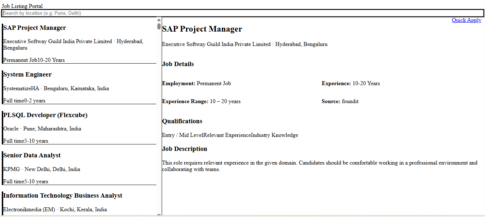

# Job Listing Platform

A full-stack Job Listing Platform built using **Node.js, Express, MongoDB, React, and Tailwind CSS**.  
The application displays job listings, allows searching by location, and shows detailed job information with a modern UI.

---

##  Features

- REST API to fetch job listings from MongoDB
- Import jobs from JSON data into MongoDB
- Search jobs by location
- Left panel job list with selection highlighting
- Right panel job details view
- Clean and responsive UI using Tailwind CSS
- Separation of backend and frontend

---

##  Tech Stack

### Backend
- Node.js
- Express.js
- MongoDB (Local)
- Mongoose

### Frontend
- React (Vite)
- Tailwind CSS
- Axios

---


## Project Structure

```bash
job-listing-platform/
│
├── backend/
│   ├── models/          # Mongoose schemas
│   ├── routes/          # API routes
│   ├── scripts/         # Data import scripts
│   ├── server.js        # Express server entry point
│   └── package.json
│
├── frontend/
│   ├── src/
│   │   ├── components/  # Reusable UI components
│   │   ├── pages/       # Page-level components
│   │   └── main.jsx     # App entry
│   ├── public/
│   └── package.json
│
└── README.md
```


---

##  Backend Setup

###  Navigate to backend directory
```bash
cd backend
```

###  Install backend dependencies
```bash
npm install
```

###  Start MongoDB using MongoDB Compass
- Open **MongoDB Compass**
- Connect to:
```
mongodb://localhost:27017
```
- Ensure MongoDB service is running

###  (Optional) Import job data
```bash
node scripts/importJobs.js
```

###  Start backend server
```bash
node server.js
```

Backend runs at:
```
http://localhost:5000
```

###  Backend API Endpoints
```http
GET /api/jobs
GET /api/jobs?location=Pune
```

```

##  Frontend Setup

###  Navigate to frontend directory
```bash
cd frontend
```

###  Install frontend dependencies
```bash
npm install
```

###  Start frontend development server
```bash
npm run dev
```

Frontend will run at:
```
http://localhost:5173
```

##  Quick Start (Both Servers)

```bash
# Start backend
cd backend
npm install
node server.js

# In new terminal start frontend
cd frontend
npm install
npm run dev
```

##  Environment Variables

Create a `.env` file in the backend directory:

```env
MONGO_URI=mongodb://localhost:27017/jobdb
PORT=5000
```

## UI Screenshots

### 🏠 Home Page
